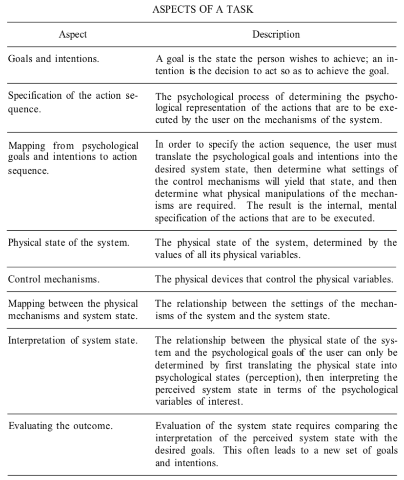
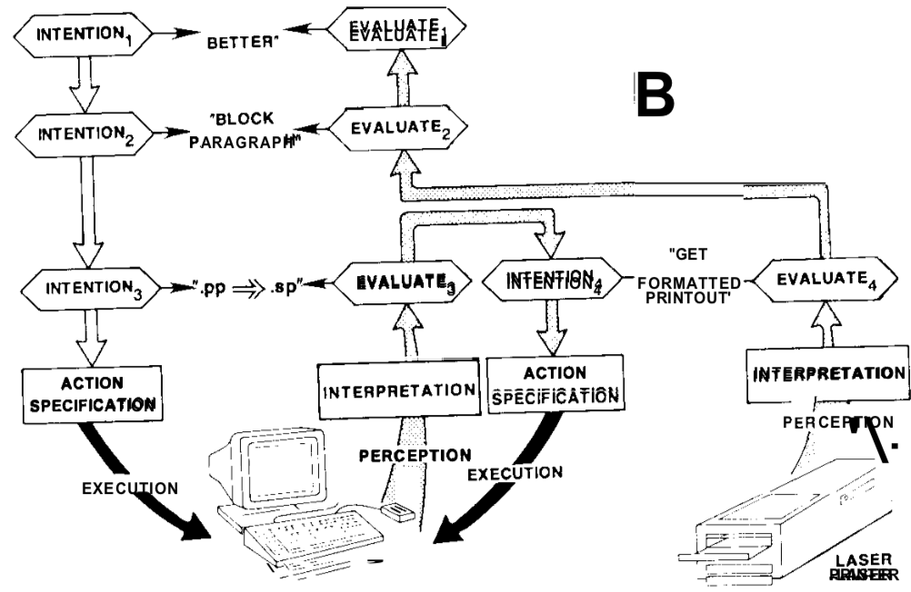

# Chapter 3: Cognitive Engineering - Donald A. Norman

---
### Prologue
*Cognitive Engineering* : A field of applied Cognitive Science interested in applying what is known from it into the design and construction of machines.
  - Goal is to understand what makes computers and their devices difficult to use.
  - Also to show what tradeoffs are made when "an improvement in one domain leads to deficits in another."

Two major goals:
  1. Understand the fundamental principles behind human action and performance that are relevant for the development of engineering principles of design.
  2. To devise systems that are, firstly, pleasant to use. Efficiency, ease of use, and power are desired, but not the focus. "*Pleasurable engagement*".

### An Analysis of Task Complexity
There is often a discrepancy between a person's psychological goals and physical system.

Consider the case of controlling water in a bathtub.
  - *Goal*: Create the right flow and temperature.
  - *Variables*: Hot and cold water valves.
  - *Problems*:
    1. *Mapping problem*: Identifying which control does what.
    2. *Ease of control*: Maintaining a specific rate of flow while adjusting for temperature or vice-versa.
    3. *Evaluation*: With two variables, is the correct outcome reached?

  - *Design Evolution*: "Single control" faucets that control temperature and flow in separate spatial dimensions.

An example number of aspects for a two variable, two goal system.
  - *Goals*: *G*1 and *G*2
  - *Intentions*: *I*1 and *I*2
  - *State*: *S*
  - *Variable*: *V*1 and *V*2
  - *Mechanisms*: *M*1 and *M*2

  - Psychological goals and intentions (*G* and *I*)
  - Physical state (*S*, *M*, *V*)

- Interaction of the control mechanism is a function of *M*1 and *M*2
  - $V_1=f(M_1, M_2)$, $V_2=g(M_1,M2)$
  - The state is a function of all variables, $S = h(V_1, V_2)$
  - Lastly, there is the complex mapping between the state and psychologial interpertation.

### Towards the Theory of action

__The major issue__: Addressing the discrepancy between psychological and physical variables that exists in the design, analysis, and use of systems

*The Gulf of Execution and Evaluation*: The bridging of the current state of the system with the goal state via user interaction with an interface. Bridges can be created through creating plans, action sequences, and interpretations.
  - *The Gulf of Execution*: Aims to translate psychological goals onto the physical system, in four primary segments.
    - *Intention formation*: How does a specific individual perceive the problem and solution?
    - *Specifying the action sequence*: What steps need to be taken?
    - *Executing the interaction*: How does the person perform the sequence?
    - *Making contact with the system*: How is the execution performed?

  - *The Gulf of Evaluation*: Aims to translate the current state of the system and provide feedback to the user through three primary segments.
    - Display of the interface.
    - Interpertation of the interface.
    - Evaluation of the interface.

Brief summary of task analysis in seven stages:
  - Establishing the __Goal__
  - Forming the __Intention__
  - Specifying the __Action Sequence__
  - Executing the __Action__
  - Perceiving the __System State__
  - Interpretating the __State__
  - Evaluating the __System State__ with respect to the __Goals__ and __Intentions__

### Conceptual Models and the System Images
The two sides to an interface:
* *System Side*, where the input and output mechanisms mediate between the psychological and physical representations.
  - Interface can be altered through improved design.
* *Human Side*, where the stages of execution and perception mediates between psychological and phyisal representations.
  - Interface can be improved through training and experience.

Conceptual models provide support for bridging the gulfs, which are often to aid in training and troubleshooting.

Three concepts to be considered, the two conceptualizations of the system constructed by the designer and user called the *design model* and *user model* respectively; and the resulting physical system built called the *system image*.
* The *design model* must consider the users capabilities. The *user model* is not formed from the *design model*, but is interpreted through the *system image*. Thereforce, the primary task of the designer is to construct an appropriate *system image*.

> It is easier to desgn consistent *Design Models* for some things than for others... Spreadsheets are relatively straightforward. General purpose operating systems or programming languages are not. (48)

### On the Quality of Human-Comptuer interaction
*The details of the interaction matter, ease of use matters, but I want more than correct details, more than a system that is easy to learn or to use: I want a system that is enjoyable to use.*

There is a difficult scenario of throttling control between overautomation and underautomation, passiveness vs lack of mapping intentions to actions.

*The computer should be invisible to the user, acting as the mans by which the person enters into the engagement, but avoiding intrusion into the ongoing throughts and activities.*

### Design Issues

---
 conviviality?
