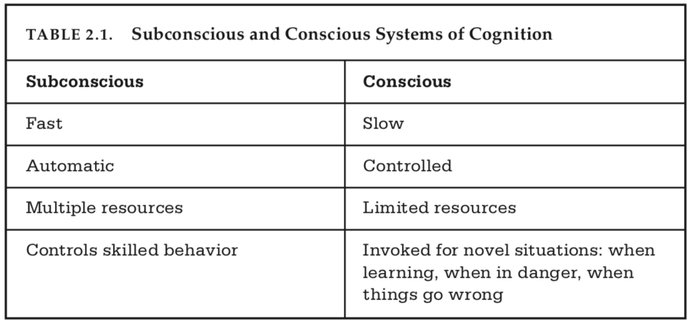

# Design of Everyday Things Ch1:
## The Psychology of Everyday actions
---
__Goal__: Explore how people *do* things, mainly to explore what users do when the technoloy isn't working.
* How do people select and evaluate their actions?
* What is the role of understanding and emotions?
* Translation of those topics into the principles of design.

---
### How People Do Things: The Gulfs of Execution and Evaluation
*The Gulf of Execution*: How does something operate?
  - Signifiers, constraints, mappings, and a conceptual model.
*The Gulf of Evaluation*: What happened?
  - Feedback, conceptual model.

* *The role of the designer is to bridge the two gulfs.*
* A small gulf represents a device that provides information about its state in a form that's easy to retrieve, understand, and matches heuristics.
* People often blame themselves or give up on devices assuming that they are at fault.
  - This rests at the core of design, fundamentally the task is simple, but the design is not.

---
### The Seven Stages of Action
There are two parts to an action, execution and evaluation.

One for __Goals__ - the Goal

Three for *Execution*:
  * __Plan__ the action
  * __Specify__ a sequence
  * __Perform__ the action sequence

Three for *Evaluation*:
  * __Perceive__ the state of the world
  * __Interpret__ the perception
  * __Compare__ the outcome with the goal

These stages of action can be subconcious and exists as a large feedback loop.
For everyday activities, goals and intentions are not well specified, and are opportunistic.
  * *Opportunistic actions* are behaviors that take advantage of circumstances rather than engaging in extensive plannign and analysis.
    - These actions are often less percise, but result in less effort than goal driven behavior.
    - Goals are generated as a result of the opportunity.

*Root cause* analysis is an approach to new products or radical ideas which involves the creation of a new goal, and a constant reevaluation of what the goal is.

Always consider the ultimate goal, eg. Theodore Levitt's quote:
> People don't want to buy a quarter-inch drill. They want a quarter-inch hole!

---
### Human Though: Mostly Subconscious
The truth is, we dont understand ourselves as much as we like to believe.

*Overlearning* psychologist's term for skills that a person is proficient at enough to perform it effortlessly and without awareness.

*Declarative memory* is memory associated with factual information.
*Procedural memory* is memories retrieved through recalling a sequency of events.

Human cognition and emotion cannot be separated. Our brains are structures to act upon the world, have expectations with every action, and those expectations drive emotion. Therefore cognitive thoughts lead to emotions.

*Cognition attempts to make sense of the world, emotion assigns value.*

The subconcious is good at generalization and is efficient, but is often biased; has trouble distinguishing common from rare events.

In comparison, concious thought is slow and labored; performed comparisons, rationalizations and explainations.

*Positive emotional state* is ideal for creative thought, but often results in scatterbrain-ness and lack of focus on a single topic.
*Negative emotional state* often causes focus and the ability to maintain attention to a single task.

A balance of both is obviouslly desired.

---
### Human Cognition and Emotion
